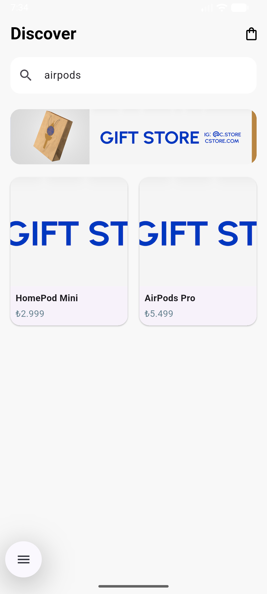
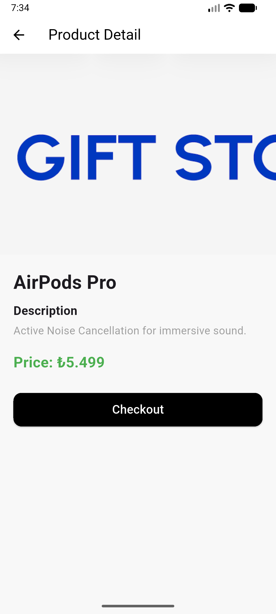

## Mini Katalog Uygulaması

## Kısa Açıklama
Flutter eğitimi kapsamında geliştirilen, ürün listeleme ve detay görme özelliklerine sahip mobil katalog uygulaması.

## Kullanılan Flutter Sürümü 
Flutter 3.41.3

## Çalıştırma Adımları
1. Bu depoyu klonlayın: `git clone <url>`
2. Paketleri yükleyin: `flutter pub get`
3. Uygulamayı çalıştırın: `flutter run`

## Ekran Görüntüleri 

